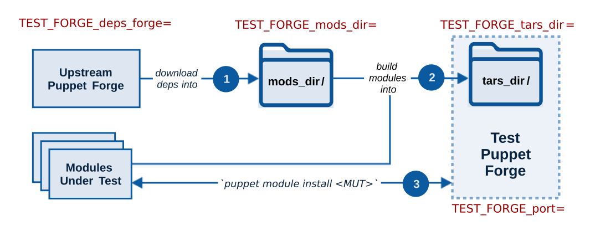
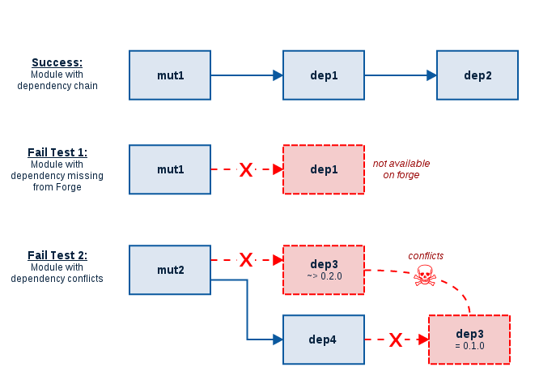

[](https://travis-ci.org/simp/rubygem-simp-module-repoclosure)
[](http://www.apache.org/licenses/LICENSE-2.0.html)
# simp-module-repoclosure

A ~~stupidly~~ admirably direct dependency validator for a Puppet module's `metadata.json`.  Use a tiny dedicated Puppet Forge to stage your modules' dependences with ` puppet module install`!

#### Table of Contents
1. [Overview](#overview)
* [What this gem does](#what-this-gem-does)
* [How it does that](#how-it-does-that)
* [Module Dependency Closuresw it does that](#how-it-does-that)
2. [Setup](#setup)
* [Beginning with simp-module-repoclosure](#beginning-with-simp-module-repoclosure)
3. [Methods](#methods)
4. [Environment variables](#environment-variables)
5. [Examples](#examples)
6. [License](#license)

## Overview

### What this gem does
For each **Module-under-test** (or **MUT**):

- [x] Validate that the MUT will install from the Puppet Forge without breaking on dep-solving problems (such as version conflicts or missing dependencies).
- [x]  Enable as much of this validation as possible **within network-isolated enclaves**.
- [ ] **TODO**: Detect if dependencies are _missing_ from `metadata.json` by using the contents of `mods_dir/` as the fixture modules for `spec_standalone` tests.
- [ ] **TODO**: Once missing dependencies are established, use the contents of `mods_dir/` to identify missing modules in the `.fixtures.yaml` file.


### How it does that
The MUT + dependencies are loaded into a local Puppet Forge and running `puppet module install <MUT>` against it.  If the installation succeeds, the dependencies  covered to publish on the live Puppet Forge.


#### Basic flow



1. _(optional)_ An upstream Puppet Forge can be used to install the dependencies for the MUT into a `mods_dir/` directory.
  - The forge server can be changed with the environment variable [`TEST_FORGE_deps_forge`](#test_forge_deps_forge)
  - With internet access and a single 
2. _(optional, enclave-friendly)_ All modules in `mods_dir/` are built into `tar.gz` archives to be served by the test Forge.
  - The `mods_dir` can be changed with the environment variable [`TEST_FORGE_mods_dir`](#test_forge_mods_dir)
  - If the `mods_dir` is defined, the upsteam dependency forge will not be contacted.
3. _(enclave-friendly)_ A temporary Puppet Forge is started on `localhost` and serves modules from `tars_dir/`.  In a separate process, `puppet module install` is run for each MUT against the localhost Puppet Forge (modules are installed into a temporary directory).  The test passes if all installs succeed.
  - The `tars_dir` can be changed with the environment variable [`TEST_FORGE_tars_dir`](#test_forge_tars_dir)


Each step of the process can be modified or skipped using [environment variables](#environment-variables) prefixed with `TEST_FORGE_` (noted in maroon text on the diagram above).
### Module dependency scenarios





## Setup

### Beginning with simp-module-repoclosure

Add this to your project's `Gemfile`:

```ruby
gem 'simp-module-repoclosure'
```


## Environment variables
You can set the environment variables `TEST_FORGE_tars_dir` and
`TEST_FORGE_mods_dir` to use pre-existing diretories of modules
for the local forge.

### TEST_FORGE_deps_forge
The upstream Puppet Forge to download MUT dependencies from.

### TEST_FORGE_mods_dir
_(enclave-friendly)_ Customize the path of the `mods_dir/` directory of unarchived module dependencies.
- If `TEST_FORGE_mods_dir` is not set, `mods_dir/` is a temporary directory.
- If `TEST_FORGE_mods_dir` is customized, deps Puppet forge is no longer used

### TEST_FORGE_tars_dir
_(enclave-friendly)_ Customize the path of the `tars_dir/` directory or archived `.tar.gz` modules.  By the time the test Forge starts, `tars_dir/` should include the MUT(s) and all dependencies.
- If `TEST_FORGE_tars_dir` is not set, `tars_dir/` is a temporary directory.
- If `TEST_FORGE_tars_dir` is customized, the Puppet Forge and `mod_path/` compilation steps will be skipped.

### TEST_FORGE_port
The TCP port on localhost or the temporary test Forge to use.  
- If TEST_FORGE_port is no set the port will default to `8080`.


## Examples
```bash
TEST_FORGE_port=8888 bundle exec rake spec
```


## License
See [LICENSE](LICENSE)

```
